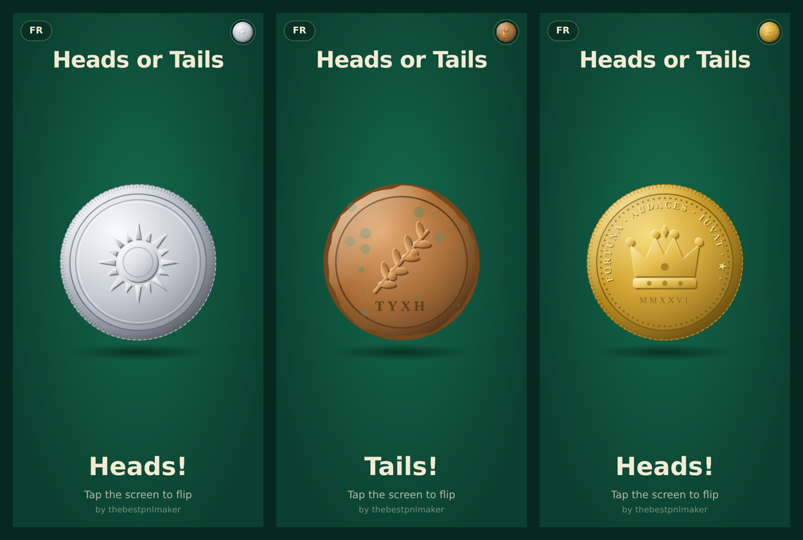

# 🪙 Heads or Tails — the trick coin

A coin flip app that looks completely random… but isn't.



**▶️ [Play it in your browser](https://thebestpnlmaker.github.io/heads-or-tails/)**
**📲 Install it:** open the link above and tap "Install app" (or Chrome menu → Install app)
**📱 [Download the Android APK](https://thebestpnlmaker.github.io/heads-or-tails/heads-or-tails.apk)**

## The trick 🤫

- Tap the **left half** of the screen → **Tails**
- Tap the **right half** of the screen → **Heads**

There's no visible line, so nobody watching can tell. The number of spins and the flight time change on every flip so it always looks natural.

Need to look innocent? **Triple-tap the title** to switch to honest mode (truly random). A tiny dot appears in the bottom-right corner so only you know. Triple-tap again to go back.

## Features

- 3 coins: silver (sun and moon), ancient bronze (owl and olive branch), and gold (crown and laurel)
- English and French, switch with the button at the top left
- 3D flip with coin thickness and a moving shadow
- Works offline, no ads, no tracking, no permissions besides vibration
- One single HTML file, nothing to install

## Install

**Easiest (Android, PC, Mac):** open the [web version](https://thebestpnlmaker.github.io/heads-or-tails/) in Chrome or Edge and tap **Install app**. You get an icon on your home screen or desktop, it opens full screen and works offline. No APK, no unknown sources.

**iPhone / iPad:** open the [web version](https://thebestpnlmaker.github.io/heads-or-tails/) in Safari, tap Share, then **Add to Home Screen**.

**Android APK:** [download heads-or-tails.apk](https://thebestpnlmaker.github.io/heads-or-tails/heads-or-tails.apk), open it, and allow installs from unknown sources if asked. If your phone saves it as `.bin`, rename it to `.apk`.

## How it works 🛠️

The whole app is a single HTML file (HTML + CSS + JavaScript). The Android APK is just a tiny wrapper that shows that page full screen.

### The trick

When you tap, the browser gives the horizontal position of your finger (`clientX`). The code compares it to the middle of the screen:

```js
outcome = e.clientX < window.innerWidth / 2 ? 'tails' : 'heads';
```

The result is decided **before the coin even leaves the table**. The animation is then calculated to land on it.

### Landing on the right side

The coin spins around a horizontal axis (`rotateX`). At 0° you see heads, at 180° you see tails. The code picks a random number of spins (5 to 7), then adds exactly what's needed to finish on the right angle:

```js
let target = angle + spins * 360;
const want = outcome === 'heads' ? 0 : 180;
target += (want - (target % 360) + 360) % 360;
```

The number of spins, the flight time (1.6 to 2 s), and a small tilt are random on every flip, so no two throws look the same.

### The 3D coin

The coin is a stack of layers: heads in front, tails behind (rotated 180°), and 11 thin discs in between, each 1px deeper, which form the edge. `backface-visibility: hidden` hides whichever side is facing away. The shadow underneath shrinks while the coin is in the air, so it looks like it really goes up.

The coins are drawn in SVG. Each design (sun, owl, crown) is drawn three times with a tiny offset, once dark, once light, once normal, which creates the embossed look.

### Honest mode

Three quick taps on the title flip an `honest` variable. When it's on, the result comes from `Math.random()` instead of your finger, so it's a real 50/50.

### Language and coin picker

Texts and coins are stored in small JavaScript objects, and the buttons just swap what's displayed. Your choices are saved with `localStorage` so the app remembers them. The buttons call `stopPropagation()` so tapping them never flips the coin.

### Installable web app

The site has a `manifest.webmanifest` (name, icons, colors) and a small service worker (`sw.js`) that caches the files, so browsers offer to install it like a real app and it works offline.

### The APK

The APK holds the HTML page, the icon, and a ~20 line Java activity that opens a full-screen `WebView` (a built-in browser with no address bar) loading the page. That's why the APK and the web version behave exactly the same, and why it's only about 60 KB.

## Made by

[thebestpnlmaker](https://github.com/thebestpnlmaker)

## License

MIT
